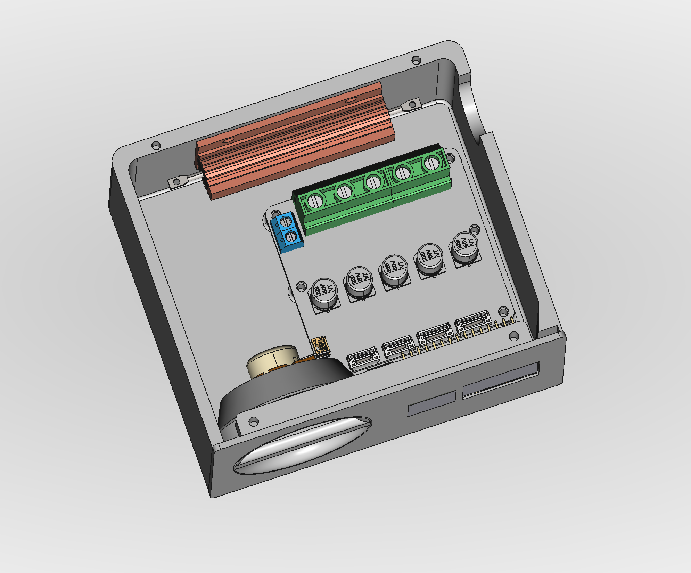

# Mostly Printed Edge Belt Sander

## Project Goals And Design Constraints

In this project I am designing and building an edge belt sander. Design constraints:

* Using only 3D printed components + widely available off-the-shelf hardware (as far as possible) to make it fast and easy to reproduce.

* For belt size 915 x 100 mm (but may offer other configurations in the final release).

* Speed controllable brushless motor.

* Belt change ~~and alignment adjustment~~ with no tools. *I had to compromise, because after adding the electronics there was not enough space for a large belt alignment screw - belt alignment now does require a hex key driver*

* Low profile form factor of less than 14cm - the sander should fit into a drawer when not in use.

* Modular design to allow for customization and faster/cheapter iteration during development.

* Ideally: Option to power from two 18V batteries.

## Overall Status

**V1 is a rough, first monolithic prototype** - probably not at all usable without lots of manual tweaking. It was not even fully tested - I only printed it and assembled without a motor to find issues with the overall design.

**V2 is work in progress** and completely unusable so far.

## Checklist And Roadmap For First Release

- [x] Prototype a rough full model to ensure the dimensions fit
  
   - [Version 1](v1)

- [x] Design, test, and refine the lever mechanism for the belt tightener
  
   - Done after testing more than 20 different prototypes: [type 1](subassemblies/disc%20lever), [type 2](subassemblies/slotblock%20lever), [type 3](subassemblies/rotating%20lever)
  
   - [Latest iteration, successfully printed and tested](subassemblies/push%20lever)
     
     

- [x] Choose a motor
  
   - Dismissed: [997 motor](components/997%20motor), mostly due to ventilation requirements.
  
   - Dismissed: [Skateboard motor type 1](components/90%20mm%20skateboard%20motor). Doesn't fit into desired envelope (see design constraints above). It is too long with the shaft included.
  
   - Dismissed: [6384 motor](components/6384%20motor). Just about fits, but with no space left for routing the cable securely and more expensive because it requires large bearings.
  
   - **Chosen**: [90 mm skateboard motor type 2](components/90%20mm%20skateboard%20motor%20(flat%20type))
     
     

- [x] Choose a BLDC controller
  
   - Dismissed: SNR8503M BLDC controller module for insufficient documentation. Is is also too close to the motor power limit, so may be risky to use anyway.
     
     
  
   - Dismissed: ZS-X11D1 module. Power limit too low & documentation insufficient.
     
     
  
   - **Chosen**: MKS XDrive (ODrive) Mini
     
     

- [x] Choose a microcontroller
  
   - Dismissed: **NodeMCU ESP8266 with 0.96 display**. Large form factor made panel dimensions too large.
   - Chosen **ESP32 S2 Mini with separate display**.

- [x] Create CAD models for all electronic components
  
   - [x] [90 mm skateboard motor](components/90%20mm%20skateboard%20motor%20(flat%20type))
  
   - [x] [MKS XDrive (Odrive) Mini](electronics/odrive-mini)
  
   - [x] Brake resistor *(3rd party model found)*
  
   - [x] 10k Potentiometer *(3rd party model found)*
  
   - [x] Power switch *(3rd party model found)*
  
   - [x] [1.3" display](electronics/1.3%20in%20display)
  
   - [x] Microcontroller *(3rd party model found)*

- [ ] Build and test the electronics
  
   - [x] Order parts
  
   - [x] Double check polarity of xdrive connectors, they use red for GND in some cases! (GPIO-connector seems wrong in photos)
     
     *The connector is indeed wrong - red is GND. Be careful.*
  
   - [x] Figure out maximum power draw of VCC pins of ODrive. (Sufficient for microcontroller+display? Otherwise need a separate step down module)
     
     *Should suffice: The XDrive uses an STM32F405RG, which according to its [data sheet](https://www.st.com/resource/en/datasheet/stm32f405rg.pdf) can provide a maximum of 240mA at 3.3v on Vdd.
     The OLED display draws 0.08W = 24.2mA, the ESP8266 has a maximum draw of 170mA and much lower with WiFi disabled. To be safe I'll disable WiFi on the controller.*
  
   - [x] Install Logic Level Converter between ODrive and microcontroller

   - [x] Install Hall sensor filter capacitors

   - [x] Assemble the whole setup

   - [x] Install and test the thermistor

   - [ ] Measure hall sensor output again to check for noise

   - [ ] Move motor thermistor to ODrive GPIO.

- [ ] Software
  
   - [x] Potentiometer to set velocity
  
   - [ ] [Configure and test ODrive with motor](components/90%20mm%20skateboard%20motor%20(flat%20type))
     *Basic movement done, but had tons of trouble for it to work properly in AXIS_STATE_CLOSED_LOOP_CONTROL, until the controller burned out.*
  
   - [x] Resolve "ENCODER_ERROR_ILLEGAL_HALL_STATE" issue by adding filter capacitors: [Encoder error ERROR_ILLEGAL_HALL_STATE](https://discourse.odriverobotics.com/t/encoder-error-error-illegal-hall-state/1047/7)
  
   - [x] Figure out ESP8266 / ODrive communication. Details of the investigation [documented here](electronics/odrive-mini/README.md)
     
     *Note that this requires a logic level converter, as the ODrive GPIOs output 5V*.
  
   - [x] [Temperature sensor](electronics/temp-sensor)
  
   - [x] [Display](electronics/1.3 in display)
  
   - [x] Retrieve and display actual speed from ODrive

   - [ ] Actually send the set speed to the controller. *Code fully prepared, just missing a one-liner at this point*

- [ ] Design and refine an electronics enclosure module to fit into the sander
  
  
  
   - [x] Potentiometer knob
  
   - [x] Panel for display and speed knob.
  
   - [x] Enclosure with mount plate for ODrive Mini and brake resistor.
  
   - [ ] Final assembly

- [x] Design and refine hub driven roller with the skateboard motor.
  
   - [x] [Model drafted](subassemblies/hub%with%20skateboard%20motor%20(flat%20type)), but some dimensions guessed for lack of technical drawings of the motor. Will need updating after finalizing the motor model.
  
   - [ ] Depending on heat development, the hub could be made slightly smaller to make the belt unit wider.

- [ ] Create the new overall assembly tying everything together.
  
   - [x] Fully model the design: *Draft done*
  
   - [x] Create new belt aligner.
  
   - [ ] Go through every feature (screws, bearings, etc.) to try and reduce the amount of different hardware needed.
  
   - [ ] Check and refine all models.
  
   - [ ] Print, test, refine, iterate

- [ ] Make a backing plate from steel or aluminium.

- [ ] Design and build the final base plate.

## Incorporate lessons learned from V1 prototype

- [x] Provide more clearance (1.5mm on each side?) between rollers and housing, to fit washers on both sides.

- [x] Make left carriage bearing cutouts larger - 23mm probably. It doesn't need tight clearance, as it is pulled to the right anyway.

- [ ] Separate the carriage arm from the bracket, make them connectable using screws. For better printability/modularity.

- [x] Make the arm shorter, to make more space for electronics in the unit.

- [x] Recess the tightener knob into the unit. *Knob became obsolete with new lever design*

- [x] Bottom could be 2mm slimmer because it will be seated in a base plate anyway. *Not slimmed down because space was needed for routing the cable in it.*

- [ ] Make lever and alignment screw in different color than the main housing.

## Potential extensions after V2

* Dust extraction

* Oscillating unit

* Reduce velocity based on proximity sensor
