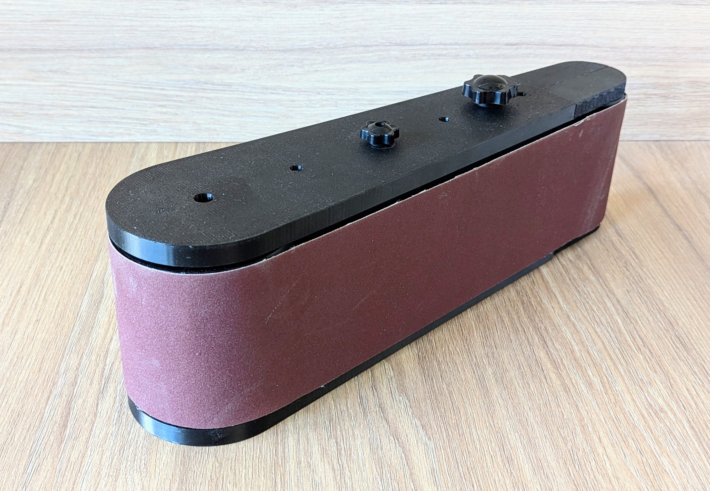
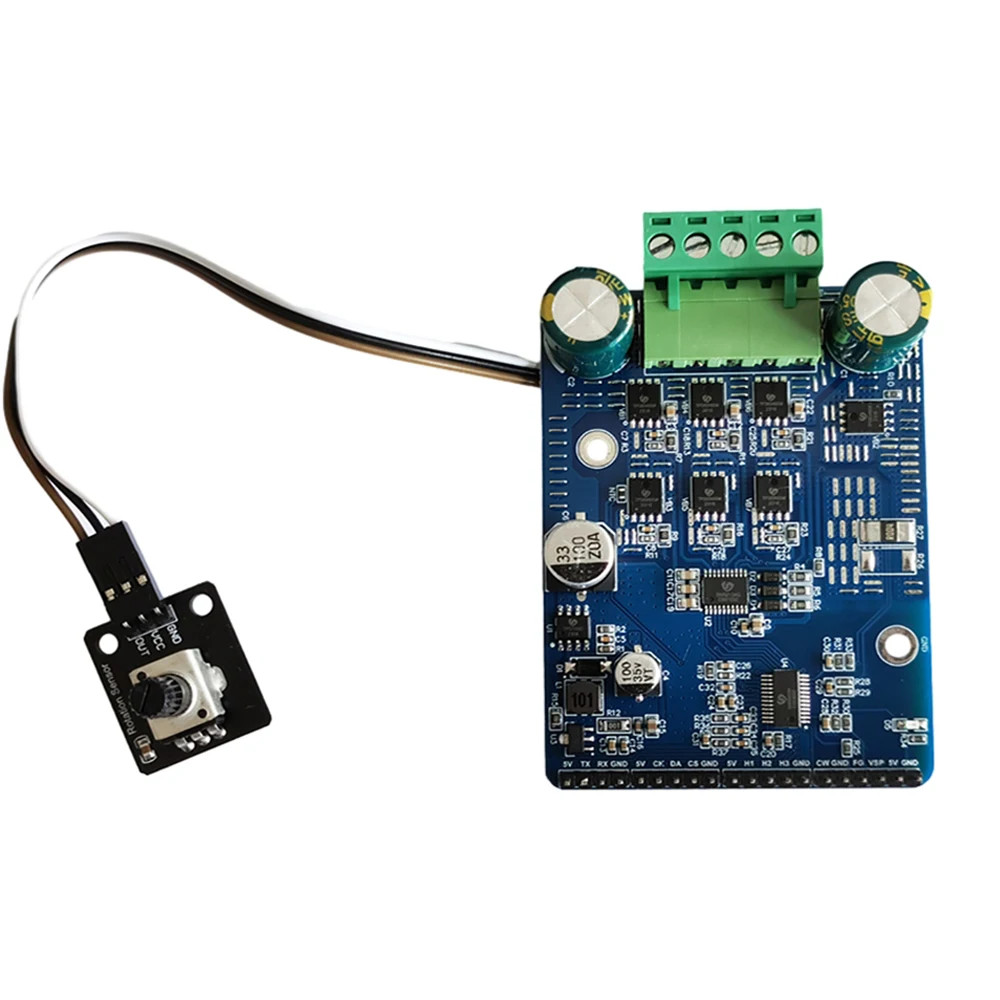
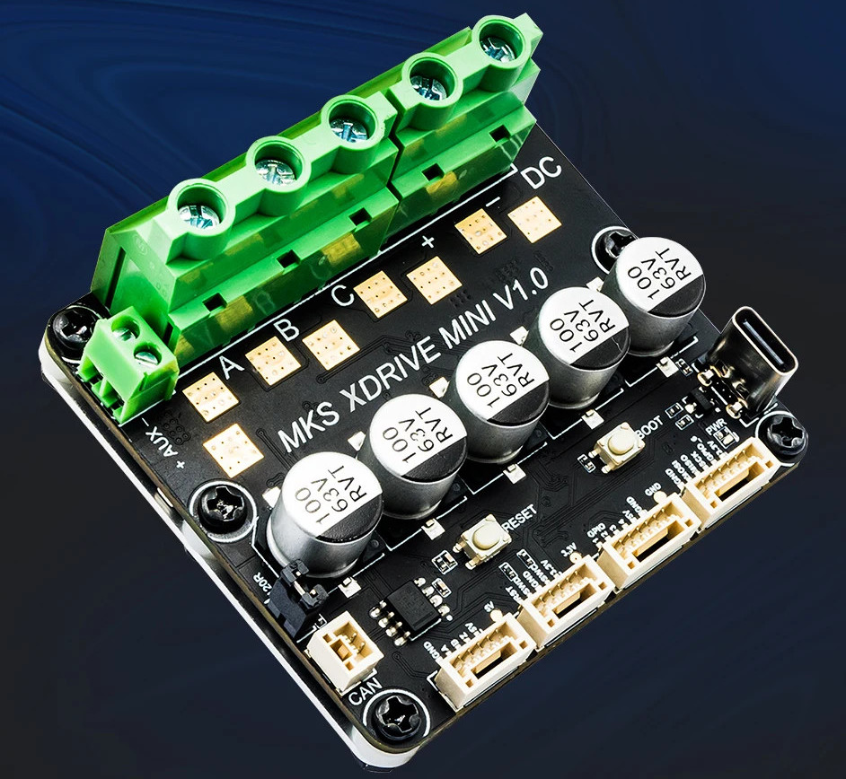

# Mostly Printed Edge Belt Sander

## Project Goals And Design Constraints

In this project I am designing and building an edge belt sander. Design constraints:

* Using only 3D printed components + widely available off-the-shelf hardware (as far as possible) to make it fast and easy to reproduce.

* For belt size 915 x 100 mm (but may offer other configurations in the final release).

* Speed controllable brushless motor.

* Belt change and alignment adjustment with no tools.
- Low profile form factor of less than 14cm - the sander should fit into a drawer when not in use.
* Modular design to allow for customization and faster/cheapter iteration during development.

* Ideally: Option to power from two 18V batteries.

## Overall Status

**V1 is a rough, first monolithic prototype** - probably not at all usable without lots of manual tweaking. It was not even fully tested - I only printed it and assembled without a motor to find issues with the overall design.

**V2 is work in progress** and completely unusable so far.

## Checklist And Roadmap For First Release

- [x] Prototype a rough full model to ensure the dimensions fit
  
   - [Version 1](v1)

- [x] Design, test, and refine the lever mechanism for the belt tightener
  
   - Done after testing more than 20 different prototypes: [type 1](subassemblies/disc%20lever), [type 2](subassemblies/slotblock%20lever), [type 3](subassemblies/rotating%20lever)
   - [Latest iteration, successfully printed and tested](subassemblies/push%20lever)
     
     

- [x] Choose a motor
  
   - Dismissed: [997 motor](components/997%20motor), mostly due to ventilation requirements.
   - Dismissed: [Skateboard motor type 1](components/90%20mm%20skateboard%20motor). Doesn't fit into desired envelope (see design constraints above). It is too long with the shaft included.
   - Dismissed: [6384 motor](components/6384%20motor). Just about fits, but with no space left for routing the cable securely and more expensive because it requires large bearings.
   - **Chosen**: [90 mm skateboard motor type 2](components/90%20mm%20skateboard%20motor%20(flat%20type))
     
     

- [x] Choose a BLDC controller
  
   - Dismissed: SNR8503M BLDC controller module for insufficient documentation. Is is also too close to the motor power limit, so may be risky to use anyway.
     
     
  
   - Dismissed: ZS-X11D1 module. Power limit too low & documentation insufficient.
     
     
  
   - **Chosen**: MKS XDrive (ODrive) Mini
     
     

- [x] Choose a microcontroller
  
   - Chose the **NodeMCU ESP8266 with 0.96 display**. Reasoning: May be overkill, but it has good mounting holes, and 3 bucks to add a speed display is totally worth it in my opinion. Not planning to use the onboard WiFi.

- [ ] Create CAD models for all electronic components
  
   - [ ] [90 mm skateboard motor](components/90%20mm%20skateboard%20motor%20(flat%20type)): **Draft done**, but some dimensions guessed for lack of technical drawings from the supplier. Will need updating once the parts arrive.
  
   - [x] [MKS XDrive (Odrive) Mini](electronics/odrive-mini)
  
   - [ ] Brake resistor *(3rd party model found, to be validated once products arrive)*
  
   - [x] 10k Potentiometer *(3rd party model found)*
  
   - [x] Power switch *(3rd party model found)*
  
   - [x] NodeMCU ESP8266 with 0.96 display *(3rd party model found)*
  
   - [ ] Fan (if needed based on testing)

- [ ] Build and test the electronics
  
   - [x] Order parts
  
   - [ ] Double check polarity of xdrive connectors, they use red for GND in some cases! (GPIO-connector seems wrong in photos)
  
   - [ ] Figure out maximum power draw of 5V pins of ODrive. (Sufficient for ESP8266+Display? Otherwise need a separate step down module)
  
   - [ ] Breadboard the whole setup

- [ ] Software
  
   - [ ] Configure and test ODrive with motor
  
   - [ ] Figure out ESP8266 / ODrive communication via SPI
  
   - [ ] Program ESP8266 with potentiometer to set velocity
  
   - [ ] Program ESP8266 to display set speed
  
   - [ ] Retrieve and display actual speed from ODrive

- [ ] Design and refine an electronics enclosure module to fit into the sander
  
  
   - [x] Potentiometer knob
  
   - [ ] Panel for display and speed knob. **Draft done, but 3rd party ESP model seems to have errors, needs updating when parts arrive**
  
   - [x] Enclosure with mount plate for ODrive Mini and brake resistor.
  
   - [ ] Final assembly

- [ ] Design and refine hub driven roller with the skateboard motor.
  
   - [ ] [Model drafted](subassemblies/hub%with%20skateboard%20motor%20(flat%20type)), but some dimensions guessed for lack of technical drawings of the motor. Will need updating after finalizing the motor model.
  
   - [ ] Depending on heat development, the hub could be made slightly smaller to make the belt unit wider.

- [ ] Create the new overall assembly tying everything together.
  
   - [ ] Create the design.
  
   - [ ] Print, test, refine, iterate

- [ ] Make a backing plate from steel or aluminium.

- [ ] Design and build the final base plate.

## Incorporate lessons learned from V1 prototype

- [ ] Provide more clearance (1.5mm on each side?) between rollers and housing, to fit washers on both sides.

- [ ] Make left carriage bearing cutouts larger - 23mm probably. It doesn't need tight clearance, as it is pulled to the right anyway.

- [ ] Separate the carriage arm from the bracket, make them connectable using screws. For better printability/modularity.

- [ ] Make the arm shorter, to make more space for electronics in the unit.

- [ ] Recess the tightener knob into the unit.

- [ ] Bottom could be 2mm slimmer because it will be seated in a base plate anyway.

- [ ] Make lever and alignment screw in different color than the main housing.

## Potential extensions after V2

* Dust extraction

* Speed display

* Oscillating unit

* Reduce velocity based on proximity sensor
