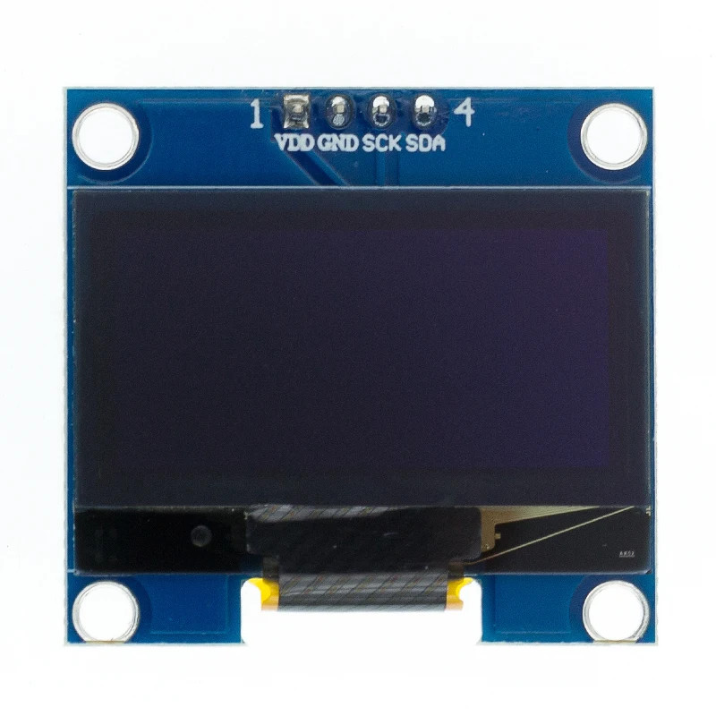
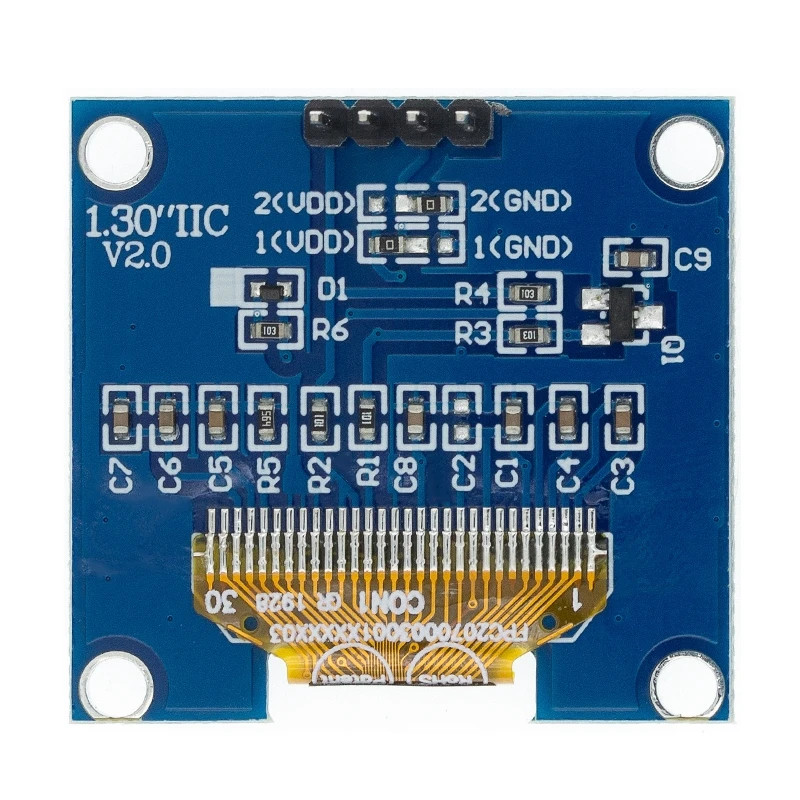

# 1.3" Display

## Vendor Description

* Drive chip SH1106

* Support for multiple operating modes: 3-wire SPI, 4-wire SPI, IIC

* Power supply DC 3V-5V

* Power consumption 0.08W

* Resolution 128x64

* Thickness 4.3 mm

* Size 35.5 x 33.5 mm

* -30 to 70 degrees C

* High-Resolution Display :This 1.3 inch OLED display module offers a high-resolution of 128*64, ensuring clear and sharp visuals for your Arduino projects.

* Versatile Color Options :With its white and blue color drive chip, this LCD module provides vibrant and striking colors, enhancing the aesthetics of your devices.

* IIC I2C Resonate LED :Equipped with IIC I2C resonate LED, this display module ensures smooth and efficient operation, making it ideal for various electronics applications.

* Compact Size :Its compact size of 1.3 inches makes it easy to incorporate into your Arduino projects, offering a sleek and modern look while providing functionality.

* Easy to Use :This LCD module is easy to use, making it perfect for both beginners and experienced users in the electronics field.

* Durable Material :Made from durable materials, this display module is designed to withstand regular use, ensuring long-lasting performance.
