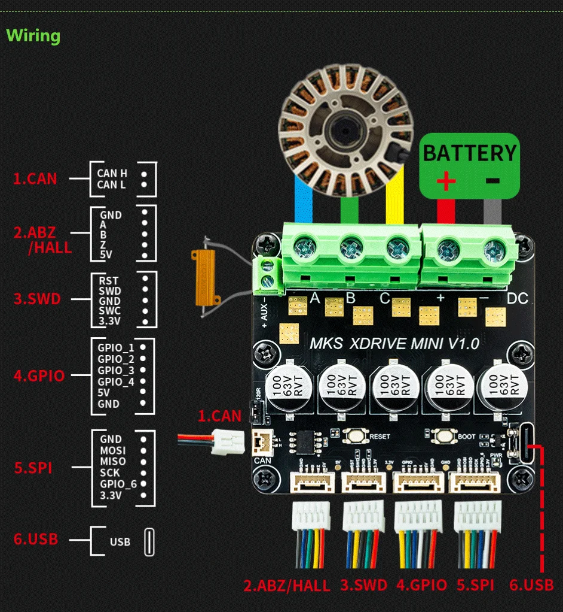
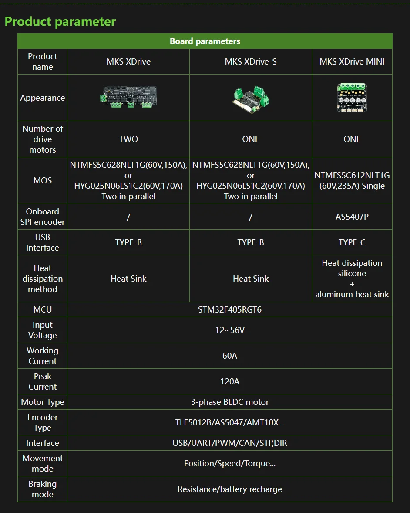

# MKS XDrive Mini (Makerbase, ODrive)

This is the BLDC controller chosen for the belt sander motor.


## Status of trying to get this product to work

### Via USB

- Connecting via USB worked with the odrivetool from the supplier repository (linked below). The official odrivetool also worked, but did not offer all configuration names of the old firmware used by the XDrive.

- I was able to make a motor spin correctly in AXIS_STATE_LOCKIN_SPIN mode only. Other modes the motor just did spin, but went into MOTOR_ERROR_DC_BUS_OVER_CURRENT.
  * Note that the hall sensor needs to be calibrated after every(!) reboot of the odrive.
  * odrv0.axis0.requested_state = AXIS_STATE_CLOSED_LOOP_CONTROL
  * odrv0.axis0.controller.config.control_mode=CONTROL_MODE_VELOCITY_CONTROL
  * odrv0.axis0.controller.input_vel = 10
  
  Maybe further hints can be found on [this Chinese website](https://blog.csdn.net/gjy_skyblue/category_10813011.html?spm=1001.2014.3001.5482)

- Under load, the controller went into `ENCODER_ERROR_ILLEGAL_HALL_STATE`. The issue may possibly be resolved by adding filter capacitors: [Encoder error ERROR_ILLEGAL_HALL_STATE](https://discourse.odriverobotics.com/t/encoder-error-error-illegal-hall-state/1047/7)
  * I did just that (used 47nF) and have so far not seen the error anymore.

### Via SPI

I found out that the SPI connector only supports encoders and cannot be used to control the ODrive :-(.

### Via UART

Important: Some versions of the XDrive Mini use 5V logic level on the GPIO pins, while others use 3.3V.
I first got an XDrive with 5V UART voltage, but after that one broke (for an unrelated reason) I ordered
a new one - and was surprised to find that this one sent 3.3V on GPIO, even though the voltage pin on the
same connector still delivered 5V.

That, or perhaps this was the firmware upgrade on the new ODrive. The old one ran 0.5.1, the new one 0.5.6.

If you get the 5V UART version (which you can pretty much only find out using an oscilloscope, a multimeter
won't suffice), then a logic level converter is needed! I used a TXS0108E because I had it at hand and
that worked fine.

Additional collected information:

- I found out that the MKS XDrive Mini has an ancient firmware version 0.5.1, though they also mangled the firmware version number output (shows v0.0.0.dev) so I don't know if they made any other changes.

- In that firmware, you have to connect to the ODrive via USB first, setting `odrv0.config.enable_uart = True` (and saving and rebooting).

- Then, the UART pins are GPIO1 and GPIO2, and they support up to 115200 baud, which worked well.

### Via I2C

Not investigated much yet. There is a setting `odrv0.config.enable_i2c_instead_of_can`, but I am not sure if it is enough to use that - it seems at least the jumper next to the CAN port needs to be removed, too, perhaps more would be needed.

### Via CAN

Unfortunately getting this to work is everything but trivial and specific to the platform you are using. For example, the ESP32-S2 mini that I tried
does not have a direct CAN controller (not to be confused with the CAN transceiver). But it can be used by configuring the onboard TWAI.

But even with your CAN controller working, you still cannot speak ASCII based odrive commands via CAN, since it only supports 8 byte packages.
Instead, a binary format must be used - and there is no library for ODrive yet which implements this.

Therefore I did not use CAN and stuck with UART instead. This has the added benefit that only one connector is needed that
supplies both power and data for my ESP32.

## Firmware update

The firmware can be updated, but not through USB with the odrivetool utility - that one throws UnicodeErrors upon trying.
An st-link adapter is required. I ordered a fake STLink for about 7 Euro and that worked.

However, I first tried to use the open source `st-flash` command line utility (i.e. not the proprietary STCube software),
but the issue is that the required ODrive firmware `ODriveFirmware_v3.6-56V.elf` is provided as .elf file, which
st-flash does not support.
Converting the .elf to .bin is theoretically possible, but this process is architecture specific and therefore non-trivial,
so I gave up and used the proprietary STCube which can be downloaded for free after registration on the ST website.

In STCube it worked without an issue. I followed the instructions from here:

https://ffbeast.github.io/docs/en/software_firmware_flashing.html

## Config

My config is here:

[config.json](config.json)

### Useful commands

In the `odrivetool` CLI utility:

```python
dev0.axis0.requested_state = AXIS_STATE_FULL_CALIBRATION_SEQUENCE
dev0.axis0.requested_state = AXIS_STATE_ENCODER_OFFSET_CALIBRATION
dev0.axis0.requested_state = AXIS_STATE_CLOSED_LOOP_CONTROL
dev0.axis0.controller.input_vel = 2
dump_errors(dev0)
dev0.clear_errors()
dev0.save_configuration()
```

## Supplier provided specs

Supplier doc/firmware repository: [GitHub - makerbase-motor/ODrive-MKS](https://github.com/makerbase-motor/ODrive-MKS)



