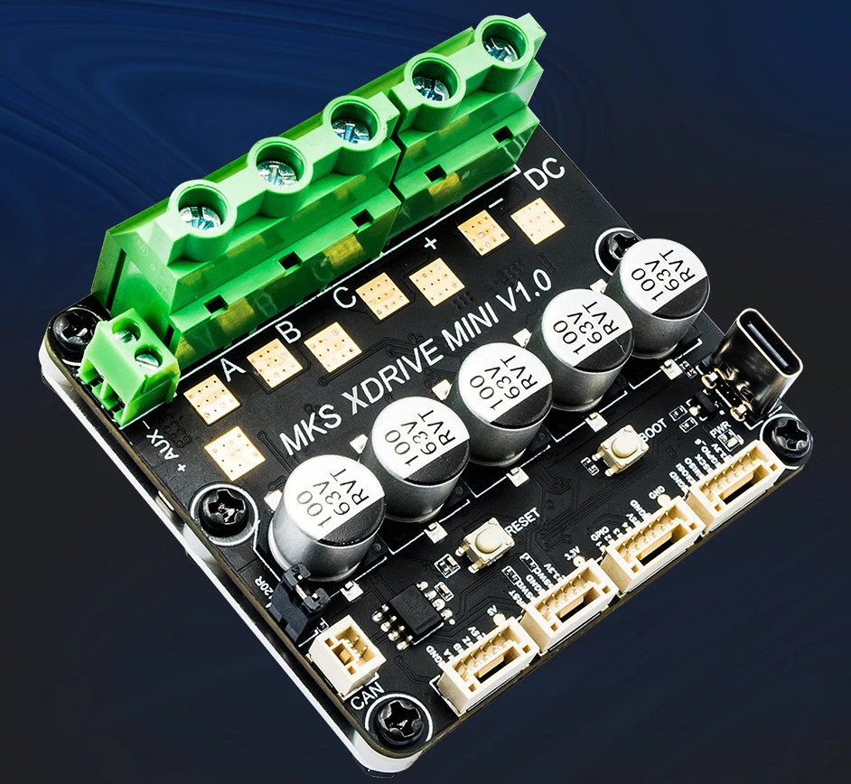

# MKS XDrive Mini (Makerbase, ODrive)

This is the BLDC controller chosen for the belt sander motor.

## Supplier provided specs

Supplier doc/firmware repository: [GitHub - makerbase-motor/ODrive-MKS](https://github.com/makerbase-motor/ODrive-MKS)

