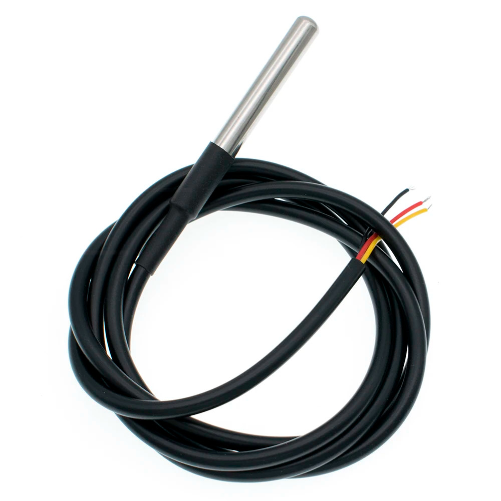

# Temperature Sensor

Used to monitor motor temperature.



## Sample code

Found [here](https://beelogger.de/sensoren/temperatursensor-ds18b20/).

```
/*
* (C) 2018 Thorsten Gurzan - beelogger.de
* 
* This program is free software: you can redistribute it and/or modify
* it under the terms of the GNU General Public License as published by
* the Free Software Foundation, either version 3 of the License, or
* (at your option) any later version.
* 
* This program is distributed in the hope that it will be useful,
* but WITHOUT ANY WARRANTY; without even the implied warranty of
* MERCHANTABILITY or FITNESS FOR A PARTICULAR PURPOSE. See the
* GNU General Public License for more details.
* 
* You should have received a copy of the GNU General Public License
* along with this program. If not, see "http://www.gnu.org/licenses/".
*/

// beelogger.de - Arduino Datenlogger für Imker
// Erläuterungen dieses Programmcodes unter https://beelogger.de 

#define ONE_WIRE_BUS 3
#define Anzahl_Sensoren_DS18B20 2 // Anzahl der angeschlossenen Sensoren - Mögliche Werte: '0','1','2',... 

#include "OneWire.h"; 
#include "DallasTemperature.h"; 

#define DS18B20_Aufloesung 12
DeviceAddress DS18B20_Adressen;

OneWire oneWire(ONE_WIRE_BUS); 
DallasTemperature myDS18B20(&oneWire); 

const float No_Val = 999.99;
float Temperatur[Anzahl_Sensoren_DS18B20];   

// Für beelogger-SMD: Aktivierung der Stromversorgung für Sensoren, Module und DS3231 
#define Power_Pin 4

void setup(void) {
  Serial.begin(9600);
  Serial.println("DS18B20 Test");
  Serial.println();
  digitalWrite(Power_Pin, HIGH);
  pinMode(Power_Pin, OUTPUT);
  delay(1000);

  Serial.print("Anzahl aktivierter Sensoren: ");
  Serial.println(Anzahl_Sensoren_DS18B20);

  if ((Anzahl_Sensoren_DS18B20 > 0)) {
    myDS18B20.begin();
    Serial.print("Anzahl angeschlossener Sensoren: ");
    Serial.println(myDS18B20.getDeviceCount(), DEC);
    Serial.println();

    for(byte i=0 ;i < myDS18B20.getDeviceCount(); i++) {
      if(myDS18B20.getAddress(DS18B20_Adressen, i)) {
        myDS18B20.setResolution(DS18B20_Adressen, DS18B20_Aufloesung);
      }
    }

  }
}

void loop(void) {
  if ((Anzahl_Sensoren_DS18B20 > 0)) {
    myDS18B20.requestTemperatures();

    for(byte i=0 ;i < Anzahl_Sensoren_DS18B20; i++) {
      if (i < myDS18B20.getDeviceCount()) {

        Serial.print("Sensor ");
        Serial.print(i+1);
        Serial.print(": "); 

        Temperatur[i] = myDS18B20.getTempCByIndex(i);
        if (Temperatur[i] == DEVICE_DISCONNECTED_C) {
            Temperatur[i] = No_Val;
          Serial.println("Fehler");
        }
        else {
          Serial.print(Temperatur[i]);
          Serial.println(" 'C");
        }
      }
    }

  }
  Serial.println();
  delay(1000);
}
```

## Vendor Description

### Supports second-line and third-line modes

Pluggable terminal waterproof DS18B20 temperature sensor can be used in many places, such as soil temperature detection, hot water tank temperature control, waterproof DS18B20 temperature sensor must also be connected to a pull-up resistor can be used, for which we designed the converter to send use.

### Specifications

Temperature sensor supply voltage: 3.0V ~ 5.5V

Temperature sensor resolution: 9 to 12 adjustable resolution

Temperature range: -55 ~ +125 ° (lead can only withstand the highest temperature of 85 degrees)

Temperature Sensor Output Lead: Yellow (DATA) Red (VCC) and Black (GND)

Adapter Cables: DATA, VCC, BLK,

Suitable platform: for Arduino and Raspberry Pi
