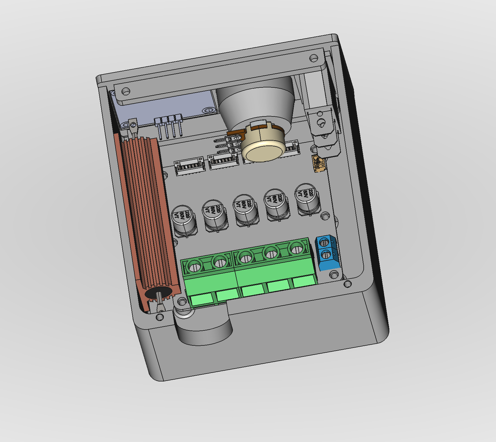

# Electronics enclosure

This enclosure is a closed unit that holds all electronics required for the sander, including a control panel with a display.

While it is fully enclosed and could be used as an external/standalone device, it is intended to be inserted into the main sanding unit.

